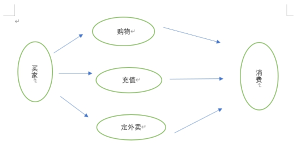
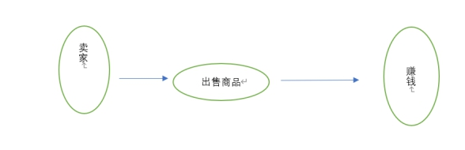
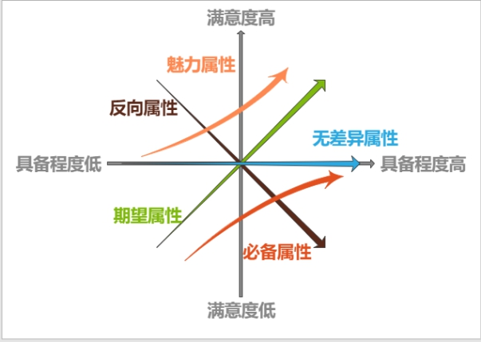
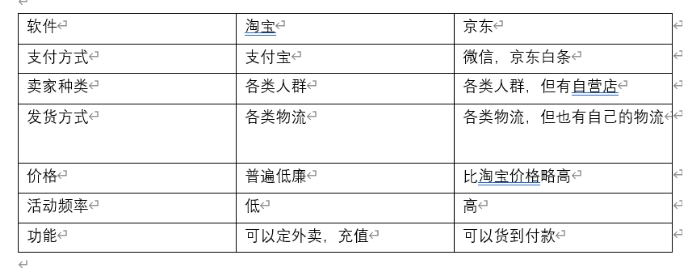

# 一．产品相关介绍（刘亚男）
## 1.我选择的产品是：
淘宝
## 2.选择淘宝的理由：
&nbsp;&nbsp;&nbsp;&nbsp;因为淘宝用户量多，受众面广，而且这个产品在日常生活中使用频繁。
## 3.淘宝的诞生背景：
&nbsp;&nbsp;&nbsp;&nbsp;在中国互联网的历史上，03年也是一个特殊的年头，作为一个新生事物的中国互联网业，已经开始尝试突破之前的“门户赢利”困局，转而寻找更现实的商业模式

&nbsp;&nbsp;&nbsp;&nbsp;2003年，中国人对网上购物已不再陌生。电子商务巨头美国eBay在此时投资1.8亿美元，接管易趣，实现了进军中国市场的战略目标。1999年成立的eBay易趣经历了中国网络经济的疯狂与寂静，可谓一枝独秀，占据着90%以上的市场份额，而且拥有良好的品牌优势和用户基础，eBay易趣在中国网络购物市场中占据绝对优势。

&nbsp;&nbsp;&nbsp;&nbsp;在这 “非典”时期，2003年5月10日晚8点整，淘宝网上线了。起初的淘宝网很少人访问，之后淘宝打出最吸引力的“王牌”——免费。充当“搅局者”的马云，不惜血本求生存意图，用阿里巴巴不断地为淘宝“输血”。而对于互联网的免费服务，国人有某种偏爱，甚至认为是“理当如此”。显然马云深谙此道。淘宝网的免费策略为淘宝拉到了众多的用户。
## 4.淘宝的发展阶段：
### 淘宝网成立初期：
&nbsp;&nbsp;&nbsp;&nbsp;2003年5月10日，淘宝网成立，由阿里巴巴集团投资创办。10月推出第三方支付工具“支付宝”，以“担保交易模式”使消费者对淘宝网上的交易产生信任。

2003年全年成交总额3400万元。次年，推出“淘宝旺旺”，将即时聊天工具和网络购物相联系起来。
### 逐渐超越竞争对手，成为亚洲最大购物网站：
&nbsp;&nbsp;&nbsp;&nbsp;2005年，淘宝网超越eBay易趣，并且开始把竞争对手们远远抛在身后。5月，淘宝网超越日本雅虎，成为亚洲最大的网络购物平台。2005年成交额破80亿元，超越沃尔玛。次年，淘宝网成为亚洲最大购物网站，就在这一年，淘宝网第一次在中国实现了一个可能——互联网不仅仅是作为一个应用工具存在，它将最终构成生活的基本要素，调查数据显示，每天有近900万人上淘宝网"逛街"。

&nbsp;&nbsp;&nbsp;&nbsp;2007年，淘宝网不再是一家简单的拍卖网站，而是亚洲最大的网络零售商圈。这一年，淘宝网全年成交额突破400亿，成中国第二大综合卖场。
　　淘宝公司分拆为三个独立公司，淘宝网（taobao），淘宝商城(tmall）和一淘网（etao）：
 
 &nbsp;&nbsp;&nbsp;&nbsp;2008年，淘宝B2C新平台淘宝商城（天猫前身）上线；汶川地震捐款平台上线，共筹得网友捐款超2000万；9月份，淘宝网单月交易额突破百亿大关。　
  
  &nbsp;&nbsp;&nbsp;&nbsp;2009年，已成为中国最大的综合卖场，全年交易额达到2083亿元。
  
  &nbsp;&nbsp;&nbsp;&nbsp;2010年1月1日 淘宝网发布全新首页，此后聚划算上线，然后又推出一淘网。

&nbsp;&nbsp;&nbsp;&nbsp;2011年6月16日，阿里巴巴集团旗下淘宝公司分拆为三个独立的公司，即沿袭原C2C业务的淘宝网（taobao），平台型B2C电子商务服务商淘宝商城(tmall）和一站式购物搜索引擎一淘网（etao）。在新的架构中，淘宝分拆后的三家公司采用总裁加董事长的机制运营。
### 双十一购物节的形成：

&nbsp;&nbsp;&nbsp;&nbsp;2012年1月11日上午，淘宝商城正式宣布更名为“天猫”。2012年3月29日天猫发布全新Logo形象。2012年11月11日，天猫借光棍节大赚一笔，宣称13小时卖100亿，创世界纪录。

&nbsp;&nbsp;&nbsp;&nbsp;2012年，11月11日，淘宝加天猫平台，将网购单日记录再次刷新为191亿元。
 ### 将淘宝电商和SNS结合，直接接入国家CCC认证信息数据库，“成交记录”模块被正式隐藏：
　　&nbsp;&nbsp;&nbsp;&nbsp;2013年，阿里调整为25个事业部，阿里巴巴通过其全资子公司阿里巴巴(中国)，以5.86亿美元购入新浪微博公司发行的优先股和普通股，占新浪微博公司全稀释摊薄后总股份的约18%，将淘宝电商和SNS的结合进行到底。
　　

&nbsp;&nbsp;&nbsp;&nbsp;2015年12月24日，阿里巴巴集团与国家认证认可监督管理委员会信息中心正式签署合作框架协议，双方共同推出“云桥”数据共享机制，阿里巴巴成为首家直接接入国家CCC认证信息数据库的电商平台。阿里巴巴旗下天猫、淘宝、1688等电商平台将导入CCC认证信息数据库实现自动校验和标注，从而避免无证以及假冒认证产品。

&nbsp;&nbsp;&nbsp;&nbsp;2016年1月27日，“成交记录”模块被正式隐藏，但原先销量、评价等信息不会消失，仍正常累积。”阿里巴巴公关部吴铭欣说，“取消(成交记录)后，将会减少不法分子通过成交记录进行的诈骗情形。”同时，如果消费者想要了解销量，只需将鼠标放到“交易成功”上，就可看到近30天的已出售件数。
# 二．调研，评测（周淋）
## 1. 下载软件并使用起来，描述最简单直观的个人第一次上手体验。
（1）使用淘宝，我们可以更加方便的购物，想买什么，淘宝里都有，而且种类多样，任你挑选。
最重要的是可以随时随地购物，这样即使你在忙在没空，只要花上了两三分钟就可以在网上购物到自己心仪的物品了，大大的节省时间和精力。

（2）总结起来就是淘宝就像一个百货公司，品种齐全，可选择范围很大，没有了大小城市、大小商店的概念，而且购物方便，通过快递公司，送货上门的软件。
## 2. 选择一个朋友（用户）进行采访，并加以记载。
#### （1）选择对象：舍友

#### （2）介绍采访对象使用的背景和需求：
当代女大学生，平时网购的需求是，物美价廉的化妆品护肤品以及好看的衣服，日常生活用品。节省时间，足不出户就能买到心仪的东西。

#### （3）让采访对象使用该产品的功能。
对不满意的商品可以进行7天无理由退换货，选择好退款原因，简要填写退款说明，就可以实现商品的退换，整个退货退款过程流畅，将商品用快递寄回去的同时，将快递单号填写上页面，淘宝迅速在第一时间将退款退回支付账户。

#### （4）描述用户使用这个产品的过程，用户的问题解决了么？软件在数据量/界面/功能/准确度上各有什么优缺点？用户体验方面有问题么？
用户退款退货的问题得到了很好的解决，软件在迅速退款方面做得很好，只要确认用户已把退货商品寄出就将退款退回支付账户，用户认为退款操作很简单又快捷。软件界面美观，功能繁多，准确度高，用户甚至 把淘宝当成“美妆百度”，生活中遇见没听过不懂的产品便在淘宝上搜索查看详情以了解产品，或者有时候代购买的东西可能是进口的，没有中文说明，不知道如何使用，也会在淘宝上搜索查看卖家写的使用说明。在功能上，除了购物，还有充话费 ，定外卖等一系列功能，用户想要的基本都可以达到，用户体验良好

#### （5）用户对产品有什么改进意见？

##### （1）用户根据之前在淘宝上购物的经历给出的意见是，认为淘宝上的卖家良莠不齐，假货有点多，希望淘宝能在这方面更加严格的把控，对产品有个检查的流程，防止假货和水货，并且对不良商家进行严肃的处罚。

##### （2）希望可以加个微信支付
### 3.结论：经过这么多工作，你一定有充分的理由给这个软件做一个评价:
非常推荐

# 三．需求分析（徐林敏）
## 1.一一列出该产品的典型用户和典型场景，并且用用例图（Use case）加以表示
买家：
 

卖家:

 

## 2. 根据KANO模型，列举出你分析的产品在四个象限中分别存在哪些功能。

 

## 3.选择获取需求的方法（比如焦点小组、深入面谈），得到该软件的需求。（对不同的典型用户可以采取不同的方法）

 深入面谈：

该软件主要就是提供一个线上交易的平台，实现用户对期望商品的选购，用户可以在这上面购买到自己想要的物品，并且希望价格更低，同时可以在这上面充话费，可以自己在这上面开店卖东西。

# 四．分析（魏凯莉）

分析这个软件目前的优劣 (和类似软件相比)，推理出这个软件团队在软件工程方面可以提高的重要方面 (具体建议)。要求把对比的结果列出一个表格，对比每个软件各自的优点和缺点。

 

我的建议，淘宝一开始确实是该行业的头头，但是近几年来随着拼多多，京东等交易平台的出现，淘宝的使用人数确实有下降，淘宝商品的普遍价格相对于别的平台还占优势，可以继续保持，另外，淘宝可以试着加入微信支付，现在很多中年人都开始使用微信。最重要的是，淘宝要对商品进行检查，从用户的反应来看，淘宝的水货比京东等要多得多，所以，可以加上个商品检查流程，最后，用户在买东西之前需要参考别人的笔记，对商品的测评，毕竟商家一定是自卖自夸，不会告诉你缺点在哪里。所以可以增加一个个人爱用好物分享模块。 

# 五．建议和规划（吴锡，杜文慧）

## 1.如果你是项目经理，如何提高从而在竞争中胜出？

如果我是项目经理，我会先对各阶层人员进行一个深入的调查，了解到各类人所需求的是什么，然后从他们需求的方面着重出手，尽最大可能的让用户感到更加方便快捷以及有丰富的体验效果。

## 2.目前市场上有什么样的产品了？

京东，唯品会，拼多多

## 3.你要设计什么样的功能？（杀手功能 or 外围功能）

商品检查功能，在商家发货的时候对商品进行检测，把结果报告给买家。

## 4.为何要做这个功能，而不是其他功能？

 我觉得，网上交易最担心的就是商品的真伪问题，因为自己也曾在淘宝上买到假货，很气愤，所以，如果能在交易流程中加上个商品检查的流程，可以让商品的真实性有保障，不会因此而失去用户。

## 5.为什么用户会用你的产品/功能？

 因为无法亲眼看见商品，所以用户对商品的质量问题肯定不能完全放心，会因为周围人的口碑而对产品产生不同的印象，如果，有个商品可以有第三方进行检验，就可以保障商品的质量问题，口碑就会上去，人民的印象就会好，用户自然就会使用这个产品。

## 6.你的创新在哪里？请用NABCD分析

1) N (Need 需求)

  用户在买东西之前需要参考别人的笔记，对商品的测评，毕竟商家一定是自卖自夸，不会告诉你缺点在哪里。

2) A (Approach 做法) 
在淘宝主页增加一个板块，这个板块里面每个人都可以分享自己的爱用好物品，分享自己对某些产品的测评，写笔记，给自己的笔记添加关键词以便别的用户可以快捷的搜索到。

3) B (Benefit 好处)
用户不需再使用别的app查找笔记，可以只用一个app就完成整个过程。喜欢分享的人也多了一个平台可以分享自己的笔记。

4) C (Competitors 竞争)
据我了解，目前全力做这个的是小红书，而小红书上主要是美妆用品，我们可以拓宽领域，分享一切生活用品，而且小红书的网购功能在我看来并不方便，相比淘宝没有什么竞争力可言。

5) D (Delivery 交付) 
鼓励用户分享自己喜欢的商品和不推荐的商品

 

 

 

​                    组长：杜文慧

​                    组员：魏凯莉，周淋，徐林敏，刘亚男，吴锡

